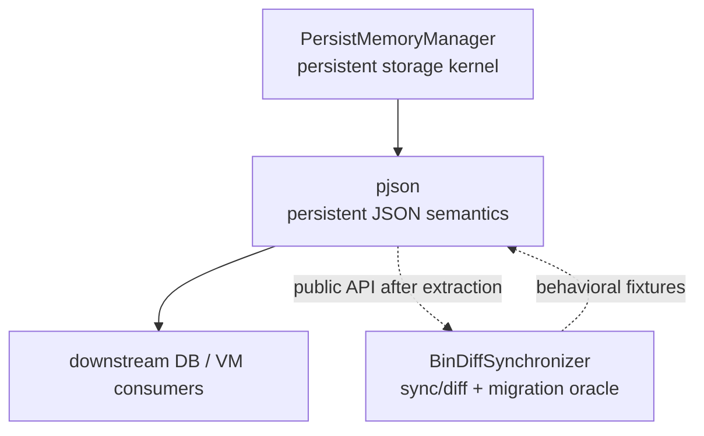
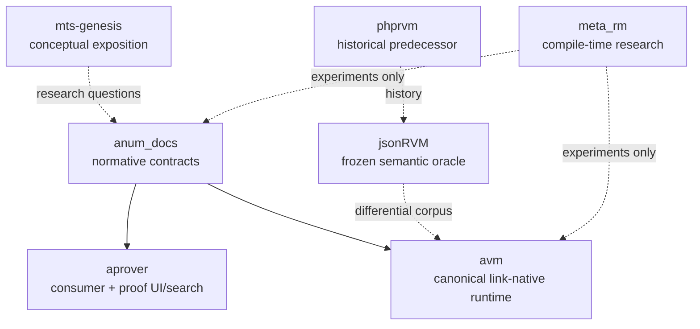
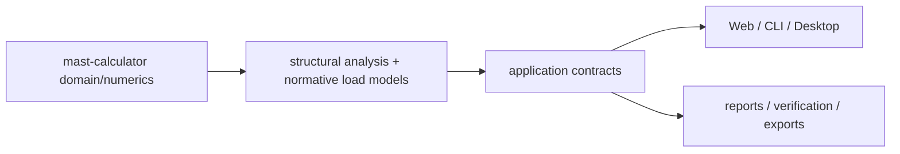
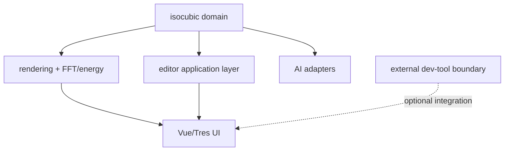
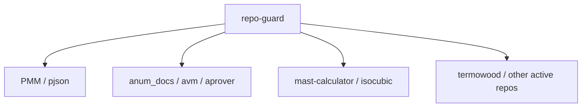

# Архитектура экосистемы netkeep80

Срез: 2026-08-09.

Этот документ фиксирует **ownership и dependency direction**. Он не утверждает, что все связи уже реализованы.

## 1. Persistent data stack



### Ownership

**PersistMemoryManager owns:**
- persistent address space and allocation;
- `pptr`/relocation semantics;
- persistent primitive containers;
- forest/domain registry;
- verify/recovery/image compatibility.

**pjson owns:**
- JSON semantic node model;
- JSON objects/arrays/scalars over PMM primitives;
- paths/CRUD;
- `$ref` / `$base64`;
- parser/serializer;
- persistence-facing JSON API.

**BinDiffSynchronizer must not remain a second owner of persistent JSON.** Its mature prototype/tests are migration evidence. After migration, its durable role is diff/sync/integration.

### Current hard gate

```text
PMM #410/#415/#416/#426
          ↓
       PMM #421
          ↓
      pjson #55
          ↓
      pjson #34
          ↓
#35 → #36 → #37 → #38 → #39 → #40 → #41 → #42/#43 → #44
```

No pjson-local compatibility storage should bypass that chain.

## 2. МТС / Relations Model stack



### Canonical roles

- `anum_docs` — единственный normative source для МТС/Anum contracts и conformance.
- `avm` — canonical future execution runtime for link-native Relations Model semantics.
- `aprover` — downstream consumer; search может быть эвристическим/untrusted, proof acceptance идёт через exact upstream replay.
- `jsonRVM` — oracle/migration corpus; не получает вторую future architecture.
- `phprvm` — historical reference.
- `mts-genesis` — философско-концептуальная публикация; не подменяет normative contract.
- `meta_rm` — compile-time research branch; не второй runtime/theory authority.

### Foundation gate

До `anum_docs#199` v0.6 остаётся candidate program. После acceptance допустим **один atomic production migration** с удалением obsolete semantics; permanent dual mode запрещён.

AVM migration завершается не количеством primitives, а differential vertical slice `avm#131` против frozen jsonRVM corpus.

## 3. Engineering calculation product



Главный invariant: Web/CLI/Desktop — adapters одного headless calculation path. Новая физика получает versioned model id, provenance и independent validation; presentation не владеет формулами.

Current priority: modal foundation → SP20 pulsation/dynamics → erection stages → independent verification passport, затем расширение UX/optimization.

## 4. isocubic product boundary



Core dependency direction должна быть framework-neutral. Phase 15 `isocubic#299` является local source of execution detail.

Отдельный unresolved boundary: standalone `god-mode` существует, а `isocubic#306` называет извлекаемый dev-tool `MetaMode`. Пока provenance/code decision не выполнен, нельзя считать эти имена одним package. После decision — один implementation на принятую роль, duplicate sources удаляются.

## 5. Shared governance



`repo-guard` — shared executable policy engine. Он должен развиваться от concrete consumer false-positive/false-negative cases, а не от абстрактного роста DSL.

Policy не обязана быть одинаковой: kernel, web product, theory repo и hardware docs имеют разные risk surfaces. Общим остаётся принцип: explicit change intent, ограниченный diff, immutable action pin, no policy weakening to bless the same change.

## 6. Physical systems

`termowood` и `aes` имеют отдельную категорию риска: код/документация влияет на реальное нагревательное и электрическое оборудование.

Roadmap ordering:

```text
hazard/failure model
→ protection/fail-safe design
→ bench/commissioning procedure
→ measured evidence
→ as-built documentation
→ only then feature expansion
```

Software safety не считается заменой независимой hardware protection там, где отказ контроллера/SSR/сети может создать опасный режим.

## 7. Research and historical layers

### Research/incubation

- `NNets` — hypothesis/evidence-driven ML experiment.
- `meta_rm` — compile-time relations experiment.
- `mts-genesis` — conceptual exposition feeding formal research questions.

Research repo должен иметь вопрос, evidence milestone и decision point `promote / continue / archive`.

### Oracle/history/archive

- `jsonRVM` — oracle до AVM migration completion.
- `phprvm` — history.
- `associative_proofs` — moved/historical pointer.
- `a-num-` — historical example.
- `usefull` — maintenance utility candidate.
- `sample_cmake`, `jgit`, `jhub` — placeholders requiring charter before implementation.

## 8. Общие правила миграции

1. **One canonical owner per layer.**
2. **Consumer moves before legacy deletion**, но deletion идёт в той же migration program, а не откладывается навсегда.
3. **No compatibility layer without a named removal gate.** Если final API уже доступен, consumers мигрируют прямо на него.
4. **Research ≠ accepted contract.** Candidate semantics не repin-ятся downstream до acceptance.
5. **Persistence identity ≠ process address.**
6. **Frontend syntax ≠ runtime semantic universe.** Особенно для JSON/Anum вокруг AVM.
7. **Engineering model changes are versioned.** Новая физика не маскируется под рефакторинг.
8. **Git is the archive.** Не хранить obsolete implementation в current source tree «для истории».