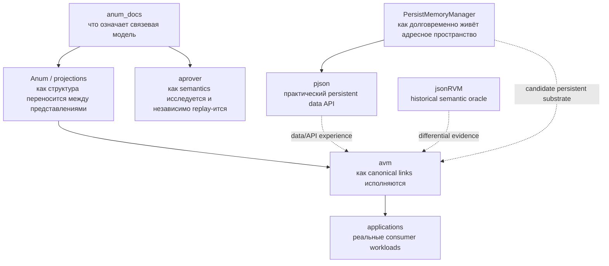

# Общий замысел экосистемы netkeep80

Срез: 2026-08-09.

Этот документ отвечает не на вопрос «что делать следующим PR», а на более важный вопрос: **зачем существует эта совокупность проектов и к какой вычислительной модели она может привести**.

Короткая версия:

> Экосистема исследует возможность построить вычислительную среду, в которой связь является универсальным структурным примитивом, ассоциативный поиск — базовой операцией, память персистентна по замыслу, а программы, данные, контекст и состояние являются различными ролями одной связевой структуры, а не разными физическими мирами представления.

Это **направление исследования**, а не утверждение, что конечная архитектура уже доказана или выбрана.

## 1. Откуда возникает задача

Обычная программная система почти неизбежно разделена на несколько миров:

```text
объекты языка
↓ serialization
файлы / JSON / database records
↓ deserialization
оперативные объекты
↓ instructions
CPU state
```

К этому добавляются:

- виртуальные адреса, которые не являются устойчивой идентичностью данных;
- отдельные форматы для памяти, передачи и долговременного хранения;
- отдельные AST/IR/runtime representations для программ;
- специальные индексы и схемы для каждого класса запросов;
- преобразования между «данными», «ссылками», «кодом» и «состоянием»;
- скрытая семантика runtime, которую трудно сериализовать, исследовать и воспроизвести.

Эти разделения полезны и исторически оправданы. Но они создают фундаментальный вопрос:

> Можно ли построить более однородную вычислительную среду, где как можно большая часть этих различий выражается структурно внутри одной модели, а не сменой носителя и набора специальных типов?

## 2. Центральная гипотеза

Рабочая гипотеза экосистемы состоит из нескольких связанных тезисов.

### 2.1. Связь как минимальный структурный примитив

В наиболее сильной формулировке МТС начинает с:

```text
всё есть связь
```

Для инженерной архитектуры достаточно более осторожного чтения:

```text
направленная связь может быть минимальным универсальным строительным блоком
для представления сложной структуры, отношений, программ и состояния.
```

Дуплет:

```text
Link(begin, end)
```

может рекурсивно представлять пары, списки, деревья, графы, отношения более высокой арности, программы и метаданные.

Например, сущность Модели Отношений:

```text
(relation, subject, object)
```

в AVM канонически представляется как:

```text
Link(relation, Link(subject, object))
```

То есть отдельный физический тип «триплет» не обязателен.

### 2.2. Ассоциативный доступ вместо господства адреса

В обычной RAM-модели главный вопрос:

```text
что лежит по адресу X?
```

В ассоциативной модели важнее вопросы:

```text
существует ли связь (A,B)?
какие связи начинаются в A?
какие связи заканчиваются в B?
какие структуры соответствуют этому образцу?
```

Адрес или внутренний `LinkId` при этом остаётся полезной локальной идентичностью реализации, но **не должен становиться смыслом объекта**.

Это сближает хранение, индексирование и вычисление: структура данных уже содержит естественные направления поиска.

### 2.3. Персистентность как нормальное состояние памяти

Современная программа обычно считает RAM первичной, а persistence — дополнительной операцией.

В рассматриваемой архитектуре предпочтительна обратная дисциплина:

```text
логическая память существует долговременно;
процесс только подключается к ней и продолжает работу.
```

`PersistMemoryManager` исследует именно этот нижний слой: устойчивые offset-based references, relocation, persistent containers, verify/recovery и образ памяти, который можно открыть по другому базовому адресу.

### 2.4. Программа и данные используют одну субстанцию, но не обязаны иметь одну роль

Тезис «program = data» сам по себе недостаточен. Если всё просто назвать данными, execution semantics никуда не исчезает.

Более точная цель:

```text
program structure
runtime values
execution context
state
proof/trace
```

могут быть представлены связями, **но их роли определяются структурой, отношениями и явным execution contract**, а не смешиваются в неразличимый граф.

AVM движется именно к такой границе: Executor принимает canonical `LinkId`; JSON и Anum остаются внешними frontend/projection layers.

### 2.5. Чтение не должно незаметно менять мир

Один из важнейших сквозных инвариантов:

```text
interpret != realize
find != realize
inspect != mutate
```

Если query, parser или interpreter при чтении автоматически создаёт отсутствующие связи, система теряет воспроизводимость и становится трудно проверяемой.

Поэтому materialization и внешние effects должны быть явными операциями.

## 3. Как существующие репозитории складываются в одну программу

Не все репозитории являются частями одного executable. Но несколько основных проектов образуют исследовательскую вертикаль.



### `anum_docs`

Нормативный исследовательский слой. Он отделяет:

```text
L0 ontology
L1 semantic carrier
L2 formal notation
L3 serialization/projection
L4 associative memory/effects
L5 proof
```

Это важно именно для будущей архитектуры: внешний синтаксис, денотация, storage identity и execution не должны смешиваться только потому, что сейчас их удобно реализовать одним классом.

### `avm`

Главный software prototype собственно ассоциативной машины.

Он уже проверяет несколько ключевых идей:

- canonical binary LinkStore;
- Relations Model поверх вложенных дуплетов;
- программы и функции как links;
- structural queries без второго query universe;
- explicit materialization;
- execution trace и inspection поверх того же runtime;
- persistent backend compatibility;
- migration от JSON-centric runtime к link-native semantics.

### `PersistMemoryManager`

Не VM и не теория связей. Его роль ниже: доказать, что крупная структура может существовать в устойчивом relocatable persistent address space без привязки identity к process address.

Если AVM отвечает на вопрос «что и как исполнять», PMM отвечает на вопрос «как такая среда физически переживает завершение процесса».

### `pjson`

Практический промежуточный слой и важный consumer PMM.

Он нужен не потому, что JSON обязан стать внутренним форматом ассоциативного компьютера. Наоборот, его ценность в том, что он проверяет:

- пригодность PMM для реальных древовидно-графовых данных;
- ownership/lifetime/persistence contracts;
- path/CRUD/codec ergonomics;
- возможность отказаться от постоянного serialize/deserialize цикла.

В долгосрочной ассоциативной архитектуре JSON вероятнее останется **frontend/interchange representation**, а не фундаментальным внутренним типом.

### `aprover`

Проверяет другой аспект общей идеи: если смысл и proof state представлены структурно, search может быть недоверенным и экспериментальным, а маленький independent checker — воспроизводимо проверять результат.

Это важный prototype принципа:

```text
powerful heuristic producer
!=
small trusted semantic consumer
```

### `jsonRVM`

Исторически важный этап: исполняемая Модель Отношений была построена поверх JSON. Теперь он полезен прежде всего как semantic oracle для доказательства, что новый link-native runtime не теряет существенное поведение.

## 4. Что здесь общего, а что нет

Экосистему не следует искусственно объявлять одним мегапроектом.

`mast-calculator`, `isocubic`, `termowood`, `aes`, `NNets` и другие проекты имеют самостоятельную прикладную ценность и собственные correctness criteria.

Но они дают полезные типы нагрузки на общие инженерные принципы:

- строгие versioned contracts;
- reproducibility;
- persistence;
- separation of core and adapters;
- deterministic execution;
- traceability;
- migration без вечных compatibility layers.

В будущем некоторые из них могут стать consumers ассоциативной среды, но roadmap **не требует** переписывать все приложения на AVM.

## 5. North-star свойства возможной ассоциативной машины

Если исследовательская программа окажется успешной, целевая система должна стремиться к следующим свойствам.

### 5.1. Один canonical relational substrate

Основная долговременная структура строится из минимального числа primitive forms. Более богатые сущности являются композициями.

### 5.2. Stable logical identity

Смысл не зависит от process virtual address, JSON node address или случайного host pointer.

### 5.3. Persistence by design

Перезапуск процесса не требует полного object graph serialization/reconstruction.

### 5.4. Associative access is first-class

Поиск exact pair, incoming/outgoing relations и structural patterns является частью базового storage/runtime contract.

### 5.5. Program/state/data structural convergence

Код, данные, execution context и результаты могут совместно существовать в одной link-native среде и быть доступны одним инструментам inspection/query.

### 5.6. Explicit effects

Pure observation, materialization и внешний effect различаются архитектурно.

### 5.7. Frontend neutrality

JSON, Anum, DSL, GUI, network protocol или C++ builder могут приводить к одному canonical program/value without becoming separate runtime universes.

### 5.8. Inspectability and replay

Исполнение должно порождать проверяемые structural traces/artifacts без необходимости снимать дамп скрытого host state.

### 5.9. Backend independence

Semantic contract не должен зависеть от одного allocator, файла, SQL engine или конкретного hardware implementation.

## 6. Куда это может привести

Минимально успешный результат уже полезен без нового железа:

```text
persistent associative database
+ link-native VM
+ common structural query layer
+ explicit effects
+ reproducible inspection/replay
```

Более сильный результат — **persistent associative runtime**, где приложение после запуска не «загружает свою модель данных», а подключается к существующему связевому пространству и продолжает вычисление.

Ещё более дальняя гипотеза — специализированная компьютерная архитектура, в которой операции поиска/канонизации/сопоставления связей поддерживаются аппаратно, а последовательный instruction stream перестаёт быть единственным центром вычисления.

Возможные варианты подробно разобраны в [`ASSOCIATIVE_COMPUTING.md`](ASSOCIATIVE_COMPUTING.md).

## 7. Что не является целью

Roadmap сознательно не утверждает следующее:

- что обычная von Neumann architecture «неправильна»;
- что графовое представление автоматически быстрее RAM;
- что всё нужно заменить одним глобальным графом;
- что structural equality должна всегда означать global semantic equality;
- что custom hardware необходим для успеха;
- что МТС уже задаёт готовую ISA;
- что PMM должен поглотить database/VM/theory layers;
- что JSON, C++ или ОС должны исчезнуть из ближайших версий.

Правильный критерий — не философская красота, а **измеримое уменьшение числа специальных representations и transformations при сохранении или улучшении correctness, inspectability и performance**.

## 8. Этапы проверки замысла

### Этап A — доказать software semantics

- один canonical LinkStore;
- one Executor;
- deterministic query/find/realize discipline;
- реальные Relations Model programs;
- differential equivalence с jsonRVM для выбранного corpus.

### Этап B — доказать persistent computing model

- AVM поверх зрелого persistent backend;
- reopen без semantic reconstruction;
- long-lived program/data/context graphs;
- crash/failure semantics;
- workload benchmarks против обычного storage + serialization подхода.

### Этап C — доказать полезный associative workload

Нужно найти задачи, где structural lookup и shared graph дают реальное преимущество:

- knowledge/relation processing;
- symbolic execution;
- dependency graphs;
- persistent agents/workflows;
- incremental computation;
- program/proof inspection;
- graph transformation.

Без такого workload переход к hardware преждевременен.

### Этап D — специализация исполнения

Только после измерений решать, нужен ли:

- optimized software index;
- SIMD/GPU accelerator;
- FPGA/CAM associative coprocessor;
- distributed LinkStore;
- custom link-processing core.

## 9. Критерий успеха всей программы

Самый сильный критерий можно сформулировать так:

> Система считается продвинувшейся к ассоциативному компьютеру не тогда, когда всё переименовано в «связи», а когда один небольшой набор проверяемых relational primitives действительно заменяет несколько независимых слоёв представления, хранения, поиска и исполнения.

То есть движение должно быть таким:

```text
меньше специальных миров
→ больше общей структуры
→ меньше неявных преобразований
→ больше явных, проверяемых contracts
→ только затем специализация performance/hardware
```
